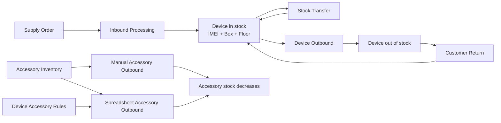

# StockPro — Product Context and UX/UI Design Brief

**Document status:** Current staging product context
**Last updated:** 21 July 2026
**Audience:** Product designers, UX designers, UI designers, and design-system contributors
**Interface language:** Professional English

## 1. Purpose of this document

This document explains what StockPro is, who uses it, how the product is structured, and which operational rules the interface must preserve. It is intended to give a designer enough context to understand the full application before creating flows, wireframes, visual designs, or a design system.

The current interface is functional and tested. A redesign may improve information hierarchy, consistency, responsiveness, accessibility, and speed of use, but it must not change the underlying warehouse rules without product approval.

## 2. Product summary

StockPro is an internal warehouse and inventory operations application. It is not an e-commerce site and it is not customer-facing.

The product tracks devices at IMEI level, the boxes containing them, their warehouse location, stock movement, accessory quantities, supply orders, customer returns, printable labels, and non-routine-duty time.

The complete operational scope includes:

- Supply orders between European offices
- Manual and spreadsheet-based inbound processing
- IMEI-level device inventory
- Box and floor location tracking
- Manual and spreadsheet-based device outbound
- Manual and spreadsheet-based accessory outbound
- Automatic accessory allocation rules by device type
- Customer returns to stock
- Internal stock transfers between warehouse floors
- Device-bin and accessory configuration
- Minimum-stock monitoring
- PDF warehouse label generation
- NRD task timing and reporting
- User invitations, roles, and module-level permissions
- Excel exports and auditable operation histories

## 3. Product goals

The design should help warehouse teams:

1. Process repetitive operations quickly.
2. Prevent inventory mistakes before data is committed.
3. Understand the current stock position at a glance.
4. Trace who performed an operation and when it happened.
5. Work efficiently with barcode scanners, pasted IMEI lists, and Excel files.
6. See errors, duplicates, unknown records, and low stock clearly.
7. Keep sensitive administration features away from unauthorized users.

## 4. Primary UX principles

### Speed for repetitive work

Warehouse operators often scan or paste many IMEIs and box codes. Primary inputs and actions must remain easy to find, keyboard-friendly, and efficient for repeated use.

### Preview before commitment

Inbound, outbound, returns, transfers, and accessory shipments use a preview-then-confirm pattern. The preview is a core safety feature, not an optional summary screen.

### Clear operational status

Users should immediately understand whether a record is valid, blocked, pending, completed, low in stock, empty, or locked.

### Traceability

Most operational modules include history, user, timestamp, reference, quantity, and export information. Designs should not hide this audit trail.

### Progressive complexity

The most common action should be visually prominent. Configuration, history, advanced filters, and exceptional cases should remain accessible without overwhelming the primary workflow.

### English consistency

All product copy must use clear professional English. Avoid mixing French and English in the interface.

## 5. Users, roles, and permissions

StockPro has three default roles. Administrators can additionally customize module permissions per user.

| Role | Typical user | Default access |
| --- | --- | --- |
| **Administrator** | Warehouse manager or system owner | All operational modules, user invitations, roles, permissions, and global exports |
| **Operator** | Warehouse team member | All warehouse operations and personal NRD tools, but no user administration |
| **Read-only** | Manager, auditor, or stakeholder | Dashboard only |

Permission-controlled modules are:

- Dashboard
- Inbound Processing
- Device Outbound
- Customer Returns
- Stock Transfers
- Label Printing
- Inventory Setup
- Accessory Outbound
- Supply Orders
- NRD Tracking
- User Access

Design implications:

- Navigation items are hidden when the user has no permission.
- Direct access to a restricted route sends the user to an **Access denied** page.
- The administrator experience must make the difference between role presets and custom module permissions understandable.
- Administration is not simply a disabled operator view; it is a separate privileged capability.

## 6. Information architecture

The current application uses a persistent collapsible sidebar. The Dashboard is a top-level destination. Other destinations are organized into expandable groups.

| Navigation group | Page label | Route | Purpose |
| --- | --- | --- | --- |
| — | **Dashboard** | `/dashboard` | Inventory overview, alerts, activity, analytics, and exports |
| **Receiving** | **Supply Orders** | `/supply` | Plan and track stock moving between offices |
| **Receiving** | **Inbound Processing** | `/inbound` | Add received devices to warehouse stock |
| **Outbound** | **Device Outbound** | `/outbound` | Remove IMEI-tracked devices from stock |
| **Outbound** | **Accessory Outbound** | `/accessories` | Remove accessories manually or from a spreadsheet |
| **Inventory** | **Inventory Setup** | `/bins` | Configure device bins, accessories, stock levels, and automatic rules |
| **Inventory** | **Label Printing** | `/labels` | Generate warehouse label PDFs |
| **Operations** | **Customer Returns** | `/returns` | Return previously outbound devices to stock |
| **Operations** | **Stock Transfers** | `/transfer` | Move boxes between warehouse floors |
| **Productivity** | **NRD Tracking** | `/nrd` | Track time spent on non-routine duties |
| **Administration** | **User Access** | `/admin` | Invite users and manage access |

There is deliberately no standalone **Alerts** page. Low-stock and empty-stock information belongs on the Dashboard. A redesign should not add an Alerts navigation item unless the product scope changes.

## 7. Global application shell

### Sidebar

- Expanded width: approximately 260 px
- Collapsed width: approximately 72 px
- Contains the StockPro name and the descriptor **Warehouse operations**
- Dashboard remains directly accessible
- Navigation groups behave as accordions
- The active group and active page are visually highlighted
- When collapsed, groups reopen the sidebar before showing their children
- The signed-in email and **Sign out** action sit at the bottom
- Icons currently come from Lucide

### Main content area

- Dark application background
- Large desktop content area with a maximum width around 1280–1400 px
- Operational pages rely heavily on cards, forms, data tables, inline previews, and modal dialogs
- Page density is intentionally higher than a marketing product because users need to compare operational data

### Staging banner

Every non-production environment displays a persistent banner:

> Test environment — do not process real inventory

This banner is a safety requirement and must remain highly visible without competing with critical errors.

### Active NRD banner

When an NRD task is running, a persistent amber banner shows:

- The active task
- Its start time
- A link to open NRD Tracking

This state follows the user across the application.

## 8. Authentication and session behaviour

### Sign in

The login screen contains:

- StockPro identity
- Email
- Password
- **Sign in**
- **Forgot password?**
- Inline error or status messaging

### Invitations and password setup

Invited users receive a link and land on **Set Your Password**. Passwords must contain at least eight characters and must be confirmed before saving.

### Secure single-session rule

Only one active browser session is allowed per account.

- If a second device signs in, StockPro shows an **Active session detected** confirmation.
- Choosing **Take over session** disconnects the older browser.
- The older browser is redirected to login with an explanation that another device signed in.
- The application checks session ownership every 30 seconds.
- It updates the active-session heartbeat every minute.
- One hour of inactivity signs the user out.

Designs should make session takeover understandable and reassuring. It is a security event, not a generic application error.

## 9. Core operational model



### Important accessory behaviour

There are two ways to remove accessories:

1. **Manual accessory outbound:** the operator explicitly selects each accessory and quantity.
2. **Spreadsheet accessory outbound:** the file may contain explicit accessory item types and IMEIs. StockPro can use the IMEIs to identify device models, apply the automatic accessory rules configured for those models, and calculate the quantities to remove.

Example rule: if a device requires one accessory per five devices and the spreadsheet contains 25 matching devices, StockPro removes five accessories.

The preview must show current stock, removal quantity, and stock after the operation. Confirmation is blocked when stock is insufficient.

## 10. Domain glossary

| Term | Meaning in StockPro |
| --- | --- |
| **Device** | A hardware product or device model, such as a telematics unit |
| **Device Bin / Inventory Bin** | The configured stock bucket for a device model. In the current data model this is stored as a `bin` |
| **IMEI** | The unique 15-digit identifier of one physical device unit |
| **Box** | A physical carton containing one or more device IMEIs |
| **Floor** | A warehouse location: Floor 00, Floor 1, Floor 6, or Cabinet |
| **Inbound** | An operation that adds received devices to stock |
| **Outbound** | An operation that removes devices or accessories from stock |
| **Transfer** | A movement of a complete box to another warehouse floor |
| **Return** | A previously outbound device coming back into stock |
| **Accessory** | A non-IMEI stock item tracked by quantity |
| **Automatic Accessory Rule** | A device-to-accessory quantity rule used during spreadsheet accessory processing |
| **Supply Order** | A planned movement of devices or accessories between offices |
| **Shipment Reference** | A human-readable identifier connecting an operation to a delivery or shipment |
| **NRD** | Non-Routine Duty: time spent on warehouse tasks outside the standard device flow |

The terms **Device**, **Device Bin**, and **Inventory Bin** are currently used close together. A design system should make the selected terminology consistent, but it must not silently rename database concepts or change user meaning.

## 11. Screen-by-screen product context

### 11.1 Dashboard

**Purpose:** Give managers and operators an immediate operational overview.

**Primary content:**

- Export Stock, Export Count Sheet, and Export Accessories actions
- Device search
- KPI cards: Total bins, Total boxes, Total IMEIs, Stock Alerts
- Device inbound versus outbound bar chart
- Monthly shipment analytics
- Recent Activity feed for inbound, outbound, returns, and transfers
- Most Shipped Devices ranking with percentage bars
- Device Inventory table
- Editable minimum stock per device bin
- Status badges: **OK**, **LOW**, and **EMPTY**
- Device drill-down showing box, floor, remaining quantity, total received, and percentage remaining
- Accessory Inventory summary and search
- Accessory categories: Packages, Vision, Harness, Consumables, and Items
- Accessory stock status: **OK**, **LOW**, and **EMPTY**

**Design considerations:**

- This is the only central alert overview.
- The page contains both device and accessory inventory and is vertically long.
- Low and empty stock must remain visible without relying only on colour.
- Export actions are useful but should not dominate the primary overview.
- The device drill-down is currently inline rather than a separate route.

### 11.2 Supply Orders

**Purpose:** Plan and monitor devices or accessories moving between offices before warehouse import.

**Supported offices:** Belgium, United Kingdom, Netherlands, Germany, France, Spain, Ireland, Portugal, and Italy.

**Lifecycle:**

```text
CREATED → SHIPPED → RECEIVED → IMPORTED
    ↘         ↘          ↘
                FAILED
```

**Rules:**

- A new order contains origin, destination, one or more device/accessory items, quantities, and an optional comment.
- Tracking becomes relevant when the order is shipped.
- A failure requires a reason.
- Imported and failed orders are locked.
- Marking an order as imported requires explicit confirmation.
- Editable transitions are deliberately limited to the next valid status or failure.

**Primary content:**

- KPI cards for Total, Created, Shipped, Received, Imported, and Failed
- Search, status filter, sorting, and pagination
- Main table with order number, creator, route, items, quantity, tracking, status, imported state, and actions
- Create/edit modal
- Detail modal with items, comment, failure reason, tracking, and status history
- Excel export

### 11.3 Inbound Processing

**Purpose:** Register received device IMEIs, boxes, device bins, and warehouse floors.

**Two input methods:**

- **Manual Inbound:** select a device bin, enter a box number, choose a floor, and scan or paste IMEIs.
- **Spreadsheet Import:** upload a vendor spreadsheet and choose a target floor.

**Supported spreadsheet vendors:** Teltonika, Quicklink, Digital Matter, and Truster.

**Core workflow:**

1. Add a reference or note.
2. Enter manual data or upload a spreadsheet.
3. Preview detected IMEIs, boxes, devices, duplicates, and unknown bins.
4. Resolve blocking errors.
5. Confirm inbound.
6. Download batch labels if needed.

**Important states:**

- Processing overlay
- Valid preview
- Duplicate IMEIs
- Unknown device or bin
- Import blocked
- Confirm disabled
- Completed inbound summary
- Labels ready for download

**History:** Date/time, user, vendor/source, reference, boxes, IMEIs, batch Excel export, and ZD220 label PDF.

### 11.4 Device Outbound

**Purpose:** Remove IMEI-tracked devices from stock.

**Two input methods:**

- Manual IMEI entry
- End-of-Day spreadsheet import

**Core workflow:**

1. Enter a shipment reference.
2. Scan/paste IMEIs or upload the End-of-Day report.
3. Preview the operation.
4. Review duplicates, unknown IMEIs, already-outbound IMEIs, device, box, floor, quantity, and remaining stock percentage.
5. Confirm only when the preview has no blocking errors.
6. The device status becomes **OUT**.

**History:** Date/time, user, source, shipment reference, device models, quantity, pagination, and per-operation Excel download.

### 11.5 Accessory Outbound

**Purpose:** Reduce accessory stock for a shipment.

**Manual mode:**

- Shipment reference and optional comment
- One or more accessory lines
- Accessory selection with current stock
- Quantity
- Add/remove line actions

**Spreadsheet mode:**

- Excel upload
- Explicit accessory rows can be read from **Item Type**
- IMEI rows can trigger the automatic accessory rules for matching device models

**Preview modal:** Accessory, quantity, current stock, and stock after. The user must confirm before stock is changed.

**History:** Date, shipment, accessory, quantity, user, and comment, with search.

### 11.6 Inventory Setup

**Purpose:** Configure the inventory catalogue and the rules used by operational screens.

This page currently contains three related responsibilities.

#### Device Bins

- Create a device bin
- View configured device bins
- Open automatic accessory rules for a selected device
- Delete a device bin

#### Automatic Accessory Rules

- Select an accessory
- Define quantity to include
- Define the device interval
- Create, edit, or delete rules
- Show a plain-language calculation example

#### Accessory Inventory

- Create an accessory
- Define initial stock and minimum stock
- Assign a category: Packages, Consumables, Harness, Vision, or Items
- Edit name, stock, minimum, and category
- Mark an accessory visible or hidden
- Delete an accessory
- Filter All, Visible, or Hidden

**Design consideration:** This is a powerful configuration page with several mental models. The designer may use tabs, sub-navigation, or progressive disclosure, provided the current relationships and actions remain clear.

### 11.7 Warehouse Label Printing

**Purpose:** Generate printable PDF labels for warehouse boxes.

**Current capabilities:**

- Default ZD220 label dimensions: 105 × 155 mm
- Editable width and height in millimetres
- Add or remove multiple label drafts
- Select the inventory bin/device
- Enter a box number
- Scan or paste IMEIs
- Show the detected valid IMEI count
- Download all valid labels as one PDF

Only unique 15-digit IMEIs are included.

### 11.8 Customer Returns

**Purpose:** Return previously outbound devices to warehouse stock.

**Return types:**

- Cancellation stop
- Technical stop

Each type has its own list of business reasons. A reference, return type, reason, destination box, destination floor, and IMEIs are recorded.

**Preview classification:**

- Valid returns
- Already in stock
- Unknown IMEI

For a valid return, the preview shows the previous device/bin, box, floor, return metadata, and target location. Confirmation changes the IMEI status back to **IN** and assigns the target box and floor.

**History:** Date/time, user, return type, reason, reference, quantity, pagination, and full Excel export.

### 11.9 Stock Transfer

**Purpose:** Move complete boxes between warehouse floors without changing device stock status.

**Core workflow:**

1. Enter one or more box codes.
2. Select the source device bin.
3. Select the destination: Floor 00, Floor 1, Floor 6, or Cabinet.
4. Preview box, device, current floor, and IMEI quantity.
5. Confirm the transfer.

**History:** Date, user, box, floor, box search, floor filter, and refresh.

### 11.10 NRD Tracking

**Purpose:** Track time spent on non-routine warehouse duties.

Examples include stock take, cleaning shelves, training, meetings, returns, inventory review, container work, order checks, workspace organization, and StockPro administration.

**Current capabilities:**

- Select and start one task
- Live `HH:MM:SS` timer
- Persistent active-task state across the application
- Stop now or correct the actual end time
- Keep a task running when the stop dialog was opened accidentally
- Month selector
- Total time and completed-task KPIs
- Task breakdown with progress bars
- Personal history
- Personal Excel export
- Global all-user export for administrators

The corrected-end-time modal is important for forgotten timers and must clearly explain the effect of each action.

### 11.11 User Access Management

**Purpose:** Invite colleagues and manage access.

**Invitation flow:**

- Enter an email address
- Choose Administrator, Operator, or Read-only
- Review or customize module permissions
- Send invitation

**Existing-user management:**

- Email and current-user indicator
- Last sign-in date
- Role selector
- Module permission checkboxes
- Save changes
- Refresh list

Admins always have all permissions. The Administration permission is not independently granted through the normal checkbox set. The last administrator cannot be demoted.

### 11.12 Access Denied

A simple recovery page explains that the user lacks permission and offers **Go to Dashboard**. It should feel informative rather than punitive.

## 12. Reusable interaction patterns

The design system should define consistent versions of the following:

- Page header with eyebrow, title, description, and actions
- KPI card
- Standard content card
- Search and filter bar
- Dense data table
- Sortable table header
- Pagination
- Status badge
- Empty state
- Loading state and blocking processing overlay
- Inline success, information, warning, and error message
- Toast notification
- Preview panel
- Standard modal
- Destructive confirmation dialog
- File-upload field
- Multi-line scanner input
- Dynamic form rows
- Progress or stock bar
- Collapsible category
- Environment banner
- Active-task banner

## 13. Required UI states

Every redesigned flow should account for:

| State | Expected behaviour |
| --- | --- |
| **Initial** | Clear starting action and helpful field labels |
| **Loading** | Prevent duplicate action while preserving context |
| **Empty** | Explain that no data exists and offer a relevant next action when possible |
| **Preview ready** | Show what will change before confirmation |
| **Blocked preview** | Explain every problem and disable confirmation |
| **Success** | Confirm what changed and reset only the appropriate inputs |
| **Recoverable error** | Keep user input where possible and explain how to fix the issue |
| **Destructive action** | Require explicit confirmation and explain consequences |
| **Locked record** | Explain why editing/deleting is no longer allowed |
| **Insufficient permission** | Hide restricted navigation and provide a clear denied state for direct access |
| **No network / server failure** | Show a useful retry path without implying that an operation succeeded |

## 14. Current visual language

StockPro currently uses a restrained dark operations-console theme.

### Foundation colours

| Token | Current value | Usage |
| --- | --- | --- |
| Background | `#080D18` | Main application background |
| Surface | `#0F172A` | Cards and controls |
| Elevated surface | `#111C31` | Raised content and modal variation |
| Border | `#1E293B` | Dividers, fields, and cards |
| Foreground | `#E5E7EB` | Primary text |
| Muted | `#94A3B8` | Secondary text |
| Brand | `#6366F1` | Primary actions and active navigation |

### Semantic accents

- **Indigo:** primary action, brand, navigation selection
- **Cyan:** inventory information, links, received state
- **Emerald:** valid, completed, inbound, confirmation
- **Amber:** warning, low stock, pending/shipped, active NRD
- **Red/Rose:** error, empty stock, destructive action, failed state
- **Slate:** neutral controls and supporting information

Colour must never be the only indicator. Status text, icon, label, or pattern should reinforce meaning.

### Typography and shape

- System sans-serif stack
- Compact operational type scale
- Rounded cards and controls, commonly 12–16 px radius
- Subtle borders and shadows rather than bright glass effects
- Uppercase tracking is used sparingly for eyebrows and environment labels

### Motion

- Fast transitions around 160–250 ms
- Small fade/slide entry motion
- Accordion and chevron motion
- Reduced-motion preferences are already respected

## 15. Current consistency gaps and design opportunities

These are suitable areas for improvement without changing product behaviour:

1. Page headers use different sizes and action placements.
2. Success and error feedback varies between inline panels, fixed messages, dialogs, and browser alerts.
3. Manual and spreadsheet workflows use similar but not identical layouts.
4. Long tables need a consistent responsive and horizontal-overflow strategy.
5. File inputs are mostly native and visually inconsistent with other fields.
6. Loading, empty, and no-results states are not equally developed on every page.
7. Dashboard exports, analytics, inventory, and accessory data compete for attention on one long page.
8. Inventory Setup combines device bins, accessory rules, and accessory inventory in one continuous page.
9. Some actions use text links while others use full buttons for similar importance.
10. Scanner-heavy tasks could use larger targets, clearer focus, and more explicit accepted-input guidance.
11. Modal widths, headers, footers, and confirmation patterns should be standardized.
12. Mobile behaviour is limited; tablet and smaller-width layouts need explicit design decisions.

## 16. Responsive priorities

Recommended design targets:

1. **Desktop 1440 px:** primary operational and management environment.
2. **Warehouse tablet 1024 px:** important for scanning and floor work.
3. **Small mobile 390 px:** safe fallback for essential reading and light actions.

Large tables may use controlled horizontal scrolling, column prioritization, or a card/list alternative. Do not hide critical validation or confirmation information on smaller screens.

## 17. Accessibility requirements

- Maintain visible keyboard focus.
- Use explicit labels; placeholders are not substitutes for labels.
- Keep scanner and textarea flows keyboard-operable.
- Do not communicate status using colour alone.
- Ensure modal focus, Escape behaviour, and action order are predictable.
- Preserve sufficient contrast in dark mode.
- Support reduced motion.
- Use clear button labels such as **Preview Inbound** and **Confirm Outbound**, not ambiguous labels such as **Submit**.
- Make dense tables readable with clear headers and row relationships.
- Confirmation buttons should remain distinguishable from cancel and destructive actions.

## 18. Copy and terminology guidance

- Use British date and time formatting where dates are displayed: `DD/MM/YYYY`, 24-hour time.
- Use sentence case for descriptions and messages.
- Use title case for page names and major action labels where the current product does so.
- Use **Sign in** and **Sign out**, not *Login* and *Logout* as button labels.
- Use **spreadsheet** in user-facing explanatory copy; use **Excel** when referring to the exported file format.
- Spell out **End-of-Day Report** before using **EOD** in new explanatory content.
- Use **IMEI** and **IMEIs** consistently.
- Use **Customer Returns**, **Stock Transfers**, **Device Outbound**, and **Accessory Outbound** consistently with navigation.
- Avoid technical database terms in user-facing copy unless operators already use them.

## 19. Non-negotiable product rules

A redesign must preserve the following unless the product owner explicitly changes them:

- Preview before confirmation for stock-changing operations
- Confirmation blocked when the preview contains blocking errors
- IMEI-level traceability for devices
- Complete-box transfers between locations
- Clear **IN** and **OUT** device states
- Low-stock and empty-stock visibility on the Dashboard
- No standalone Alerts navigation item
- Manual and spreadsheet processing remain available
- Automatic accessory rules remain configurable by device bin
- Operation histories and exports remain accessible
- Role- and permission-based navigation and route access
- Single active session per account
- One-hour inactivity sign-out
- Visible staging safety banner
- English-only professional interface copy

## 20. Suggested design deliverables

For a complete redesign, the recommended deliverables are:

1. Product foundations: colour, typography, spacing, radius, elevation, icon, and motion tokens.
2. Responsive application shell and navigation.
3. Authentication, password setup, session takeover, and access-denied screens.
4. Dashboard information architecture for device and accessory inventory.
5. A canonical preview-confirm operation pattern.
6. Manual and spreadsheet variants of the canonical pattern.
7. Supply-order lifecycle and detail experience.
8. Inventory Setup structure for device bins, accessory rules, and accessories.
9. Standard table, filter, pagination, export, and history patterns.
10. Status, empty, loading, warning, error, success, locked, and insufficient-permission states.
11. Desktop and warehouse-tablet designs for all core workflows.
12. A component handoff specification compatible with the existing application stack.

## 21. Technical context for design handoff

The implementation currently uses:

- Next.js 14
- React 18
- TypeScript
- Tailwind CSS 4
- Supabase for authentication and data
- Lucide for icons
- Recharts for dashboard charts
- Motion for selected transitions
- ExcelJS and SheetJS for spreadsheet workflows
- PDFKit, pdf-lib, and QR Code generation for labels and exports

Designs should favour reusable components and tokens that map cleanly to Tailwind and React. There is no need for heavy raster imagery; the product is primarily a data-rich operational tool.

## 22. Staging and safety for design review

Design review and usability testing must use staging data only. Never enter real IMEIs, real customer information, or production credentials in a preview environment.

Current branch preview:

`https://stockpro-v9-5mas-git-codex-staging-7fbb48-sohib-blips-projects.vercel.app/login`

The cyan test-environment banner must be visible before using test data.

## 23. Product success criteria for a redesign

A successful StockPro design should make a first-time operator able to:

- Understand where to receive, ship, return, and transfer stock
- Distinguish a device, IMEI, box, floor, accessory, and supply order
- Complete a common scan-and-preview workflow without training
- Understand exactly why an operation is blocked
- Confirm a stock change with confidence
- Find recent history and export evidence
- Recognize low and empty stock immediately
- See when a record is locked or permission-restricted
- Continue working efficiently on a warehouse tablet

At the same time, an experienced operator should be able to process repeated operations with minimal clicks and minimal visual distraction.
